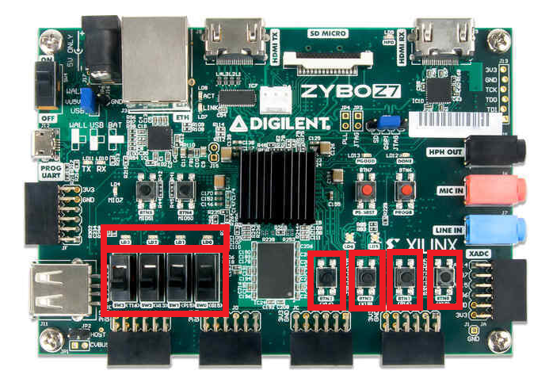

# 実機でトークンを周回させる

## トークンの数

SW0 ～ 3 でトークンの数を指定します。

## リセット

BTN0 を押すとリセットします。

## プログラム書き込み

BTN1 を押すと DDP にプログラムを投入します。

## データ書き込み

BTN2 を押すと DDP にデータを投入します。

## LED

BTN3 を押すと LED の点灯/消灯を切り替えます。
